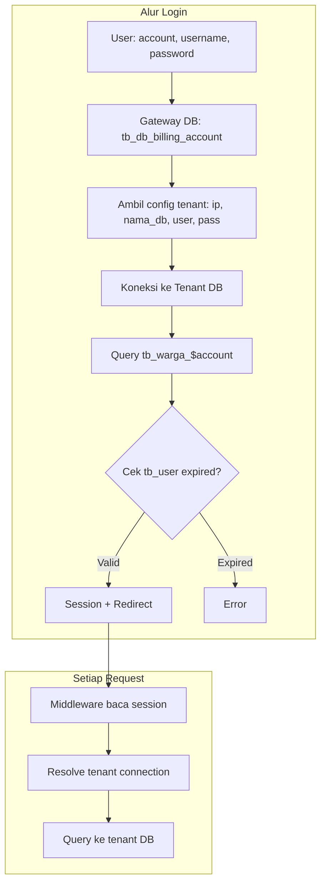

# Migrasi Script Login eBilling ke Laravel

## Ringkasan Arsitektur Legacy




**Legacy:**

- Gateway DB: `tb_db_billing_account` — gunakan schema dari [db_billing.sql](db_billing.sql) (schema `db_billing`, kolom: ip, nama_db, username, password, account, nama_server, file, id PK, UNIQUE idx_account)
- Tenant DB: `tb_warga_$account`, `tb_user`, `tb_log`
- Password: plain text (backward compat)
- Redirect: mapping account → URL eksternal

---

## 1. Database & Konfigurasi

### 1.1 Koneksi Database

Tambahkan di [config/database.php](config/database.php):

- **Gateway**: Pakai koneksi `mysql` default dari `.env` (DB_HOST, DB_PORT, DB_DATABASE, DB_USERNAME, DB_PASSWORD) — tidak perlu env terpisah. Tabel `tb_db_billing_account` ada di database ini.
- **Tenant**: Koneksi dinamis — di-resolve saat runtime dari session (host/port/database dari `tb_db_billing_account`)

### 1.2 Schema Gateway

Gunakan [db_billing.sql](db_billing.sql) sebagai referensi schema gateway:

- Database: `db_billing` (pastikan `.env` DB_DATABASE sesuai, mis. `db_billing` atau `ebilling` tergantung nama DB yang di-import)
- Tabel `tb_db_billing_account`: kolom `ip`, `nama_db`, `username`, `password`, `account`, `nama_server`, `file`, `id` (PK, auto_increment)
- UNIQUE INDEX `idx_account` pada kolom `account` — siap untuk lookup per account
- Import `db_billing.sql` ke server DB yang dikonfigurasi di `.env`, atau buat migration Laravel yang mereplikasi struktur ini untuk version control

---

## 2. Model & Service

### 2.1 Model

- `**BillingAccount`** — Eloquent untuk `tb_db_billing_account` (gateway)
- `**Warga**` (atau `TenantUser`) — model dinamis untuk `tb_warga_$account`; table name di-set dari `account` (e.g. `tb_warga_39511`)

### 2.2 Service: `TenantConnectionService`

Lokasi: `app/Services/TenantConnectionService.php`

- `getTenantConfig(string $account): ?array` — query `tb_db_billing_account` di gateway (koneksi default mysql dari .env), return `[host, port, database, username, password]`
- `createTenantConnection(array $config): Connection` — buat koneksi MySQL dinamis via `Config::set` + `DB::connection('tenant')`
- `resolveHostPort(string $ip): [host, port]` — parse string seperti `10.40.30.14:1991` jadi host dan port

### 2.3 Service: `LegacyLoginService`

Lokasi: `app/Services/LegacyLoginService.php`

- `attempt(string $account, string $username, string $password): array|false`
  - Ambil config tenant dari `TenantConnectionService`
  - Koneksi ke tenant DB
  - Query `tb_warga_$account` WHERE username, password (plain), account, status=1
  - Query `tb_user` WHERE account untuk cek `expired_user`
  - Return data user + config tenant jika valid, `false` jika gagal
- `logLogin(array $userData): void` — insert ke `tb_log` di tenant

---

## 3. Auth Custom (Non-Standard Laravel Auth)

Karena pakai session custom (bukan `users` table), **tidak** memakai `Auth::attempt()` standar.

### 3.1 Session Structure

Simpan di session (setelah login sukses):

```php
[
    'tenant' => ['host', 'port', 'database', 'username', 'password'],
    'user' => [
        'id_warga', 'id_lokasi', 'account', 'alamat', 'kecamatan', 'kabupaten',
        'propinsi', 'kode_pos', 'nama_warga', 'username', 'level', 'status',
        'rt', 'rw', 'blok', 'no_rumah', 'expired_user', 'tlp_user', ...
    ],
]
```

### 3.2 Custom Guard / Helper

- Buat helper `billing_user()` atau `session('billing.user')` untuk akses data user
- Atau custom User Provider + Guard jika ingin integrasi penuh dengan `Auth::user()` — opsional, bisa cukup pakai session

---

## 4. Controller & Form Request

### 4.1 `AuthenticatedSessionController` (atau `LoginController`)

- `create()` — GET, return view login (sudah ada di [resources/views/auth/login.blade.php](resources/views/auth/login.blade.php))
- `store(LoginRequest $request)` — POST:
  - Panggil `LegacyLoginService::attempt()`
  - Jika sukses: set session, cek redirect per account, redirect
  - Jika gagal: back dengan error

### 4.2 `LoginRequest`

Validasi: `account`, `username`, `password` required (string).

---

## 5. Redirect Mapping

Buat config `config/billing.php` atau array di service:

```php
'account_redirects' => [
    '6107' => 'https://billing.yamnet.id',
    '5087' => 'https://billing.yesimedia.co.id',
    '3395' => 'https://terabit.ebilling.id',
    // ... dari script legacy
],
'default_redirect' => '/dashboard', // atau URL default
```

Logic: jika account ada di mapping → redirect ke URL eksternal; jika tidak → redirect ke route Laravel (mis. dashboard).

---

## 6. Middleware

### 6.1 `EnsureBillingAuthenticated`

- Cek `session('billing.user')` ada
- Jika tidak: redirect ke `route('login')`
- Jika ada: resolve tenant connection dari session dan set ke `DB::connection('tenant')` untuk request tersebut

### 6.2 `ResolveTenantConnection`

- Baca session tenant config
- Panggil `TenantConnectionService::createTenantConnection()` 
- Set `DB::connection('tenant')` agar model/query tenant memakai koneksi ini

Daftarkan middleware di [bootstrap/app.php](bootstrap/app.php) dan terapkan ke route yang butuh auth.

---

## 7. Route & View

### 7.1 Route

Di [routes/web.php](routes/web.php):

- `GET /login` → `AuthenticatedSessionController@create` (tetap)
- `POST /login` → `AuthenticatedSessionController@store`
- `POST /logout` → destroy session, redirect login
- Route yang butuh auth (dashboard, dll) → group dengan middleware `billing.auth`

### 7.2 View Login

Update [resources/views/auth/login.blade.php](resources/views/auth/login.blade.php):

- Ubah `id_akun` → `account` (atau tetap `id_akun` jika konsisten dengan naming)
- Pastikan form POST ke `route('login')`
- Tambah link "Lupa Password" dan "Registrasi" ke URL eksternal (sesuai legacy) jika diinginkan

---

## 8. Logout

- Route `POST /logout` 
- `session()->forget(['billing.user', 'billing.tenant'])` atau `session()->flush()` jika hanya session billing
- Redirect ke login

---

## 9. File yang Perlu Dibuat/Diubah


| Aksi | File                                                                              |
| ---- | --------------------------------------------------------------------------------- |
| Buat | `app/Services/TenantConnectionService.php`                                        |
| Buat | `app/Services/LegacyLoginService.php`                                             |
| Buat | `app/Http/Controllers/Auth/AuthenticatedSessionController.php`                    |
| Buat | `app/Http/Requests/Auth/LoginRequest.php`                                         |
| Buat | `app/Http/Middleware/EnsureBillingAuthenticated.php`                              |
| Buat | `app/Http/Middleware/ResolveTenantConnection.php`                                 |
| Buat | `app/Models/BillingAccount.php`                                                   |
| Buat | `config/billing.php` (redirect mapping)                                           |
| Edit | `config/database.php` (koneksi tenant dinamis; gateway = default mysql dari .env) |
| Edit | `bootstrap/app.php` (registrasi middleware)                                       |
| Edit | `routes/web.php` (route login POST, logout, middleware)                           |
| Edit | `resources/views/auth/login.blade.php` (penyesuaian field jika perlu)             |


---

## 10. Catatan Keamanan & Migrasi Data

- **SQL Injection**: Gunakan query builder / Eloquent, jangan raw query dengan input user
- **Password plain**: Untuk backward compat; rencanakan migrasi ke hash di fase berikutnya
- **Session**: Pastikan `config/session.php` aman (secure, httponly, same_site)
- **Tabel tb_user, tb_log**: Diasumsikan ada di tenant DB; jika belum ada, perlu migration di sisi tenant atau dokumentasi untuk DBA

---

## 11. Testing

- Feature test: POST login dengan credential valid → session terisi, redirect benar
- Feature test: POST login invalid → error, tidak ada session
- Feature test: Request ke route protected tanpa session → redirect ke login

